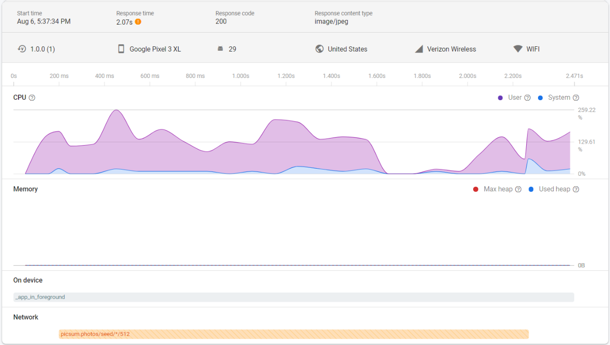

# traced\_cache\_manager

[Cache Manager](https://pub.dev/packages/flutter_cache_manager) implementation that integrates with 
[Firebase Performance Monitoring](https://firebase.google.com/docs/perf-mon) to automatically 
record traces for network requests.



## Background

The Firebase Performance [flutter plugin](https://pub.dev/packages/firebase_performance) allows
your app to record traces for network requests and publishes them to 
[Firebase Performance Monitoring](https://firebase.google.com/docs/perf-mon). 
However, the plugin does not automatically collect traces for **all** network requests your app makes.

One popular unsupported widget is [`cached_network_image`](https://pub.dev/packages/cached_network_image),
a flutter library to show images from the internet and keep them in the cache directory. Under the hood,
this widget uses [`flutter_cache_manager`](https://pub.dev/packages/flutter_cache_manager) to 
download and cache files in the cache directory of the app. When a cache miss occurs, the network
request to download the file is not automatically traced with Firebase Performance flutter plugin.

This package (`traced_cache_manager`) provides a custom Cache Manager implementation that automatically
traces network requests and publishes them to Firebase Performance Monitoring. It can be used with
[`cached_network_image`](https://pub.dev/packages/cached_network_image) to automatically trace network
requests when downloading images from the internet.

## Setup

1. Add the Firebase Performance [flutter plugin](https://pub.dev/packages/firebase_performance) to your app.
Follow the setup instructions in that package to integrate with Firebase Performance Monitoring.
2. [Install](https://pub.dev/packages/traced_cache_manager/install) this package.

## Usage

There are 3 use cases for this custom cache implementation.

### With cached\_network\_image

Automatically trace all network requests made by the `CachedNetworkImage` widget.

```flutter
CachedNetworkImage(
  imageUrl: 'https://picsum.photos/500',
  ...
  cacheManager: TracedCacheManager(),
)
```

### As a general file cache

Automatically trace all network requests made when fetching files for the cache.

```flutter
Future<File> fetchFile(String uri) async {
  return await TracedCacheManager().getSingleFile(uri);
}
```

### In a custom Cache Manager implementation

If you are writing a custom cache implementation and want automatic tracing of network requests,
you can use `TracedHttpFileService` as an argument to the `BaseCacheManager`.

```flutter
class MyCustomCacheManager extends BaseCacheManager {
  ...
  MyCustomCacheManager({...}) : super(key, fileService: TracedHttpFileService(), ...);
}
```

## Troubleshooting

If you have an issue with this library, file an [issue](https://github.com/nareddyt/traced_cache_manager/issues).

If you do not see traces in the Firebase Console, reference the official Firebase
[Troubleshooting Guide](https://firebase.google.com/docs/perf-mon/troubleshooting?platform=android).
Note that it may take 24-48 hours for network traces to show up.

Consider clearing your application's cache to force network requests on a cache miss.
- [Android example](https://www.androidcentral.com/how-and-when-clear-app-cache-or-data-android).
- [iOS example](https://www.macrumors.com/how-to/clear-cache-iphone-ipad/).

## Contributing and Support

Pull requests are welcome.
For major changes, please open an issue first to discuss what you would like to change.

## License

[MIT](https://choosealicense.com/licenses/mit/)